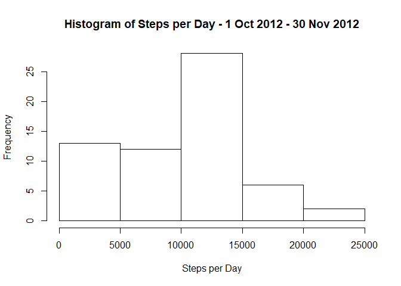
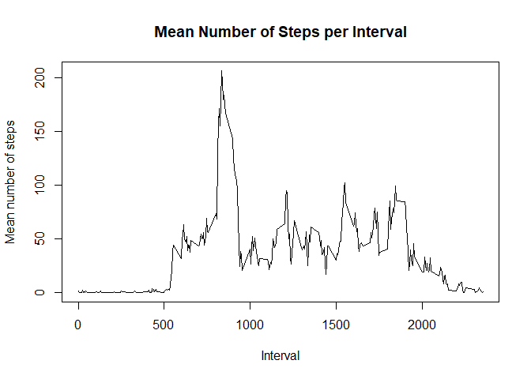
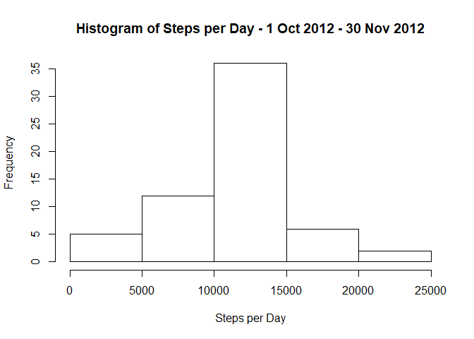

This is submitted by Andrew Lyons as part of the assignemt for Week 2 - Reproducible Research - Coursera Data Science Course.

## Loading and preprocessing the data
In this first step, the necessary libraries are loaded:

```r
library(magrittr)
library(dplyr)
library(ggplot2)
library(lubridate)
library(lattice)
```
Following this, the data is read into the variable "activitydata" and the date column is converted to the correct data type:

```r
activitydata<-read.csv("activity.csv", header = TRUE, stringsAsFactors = FALSE, colClasses = c("integer", "character", "integer"), nrows=17568)
activitydata$date<-ymd(activitydata$date)
```
## What is mean total number of steps taken per day?
The following code calculates the mean and median number of steps taken per day:

```r
#This variable contains the total steps grouped by day
dailysteps<-activitydata %>%
    group_by(date) %>%
    summarise_all(sum, na.rm=TRUE)
meandailysteps<-mean(dailysteps$steps, na.rm = TRUE)
mediandailysteps<-median(dailysteps$steps, na.rm = TRUE)
```
The mean number of steps per day is 9354.23 and the median number of steps per day is 10395.  
The following is a histogram of the total number of steps taken per day over the measurement period:  

```r
dailyhist<-hist(dailysteps$steps, xlab = "Steps per Day", 
     main="Histogram of Steps per Day - 1 Oct 2012 - 30 Nov 2012")
```

<!-- -->

## What is the average daily activity pattern?

The following code groups the steps by interval and plots the mean number of steps per interval.  


```r
#This variable groups the steps by interval and finds the mean for each interval
intervalsteps<-activitydata %>%
    group_by(interval) %>%
    summarise(meaninterval=mean(steps, na.rm=TRUE))
plot(x=intervalsteps$interval, y=intervalsteps$meaninterval, type="l", 
     ylab="Mean number of steps", xlab="Interval", main="Mean Number of Steps per Interval")
```

<!-- -->

```r
#The data is arranged in descending order so that we can find the interval with the max number of mean steps.
arrangedinterval<-arrange(intervalsteps, desc(meaninterval))
maxinterval<-arrangedinterval[1,1]
```
The interval that contains the greatest number of steps is number 835.  

## Imputing missing values

In this section, the problem of missing values is addressed. First, this code calculates the total number of missing values in the dataset.  

```r
missingrows<-sum(is.na(activitydata$steps))
```
The total number of missing values in the dataset is thus found to be 2304.   
In this code chunk, missing values are replaced. The method used is to calculate the mean steps for each interval, and replace the missing values with the mean number of steps for the relevant interval.  


```r
activitydata2<-activitydata
activitydata2$interval<-as.factor(activitydata2$interval)

#This calculates the mean of the steps, broken down by interval.
Means <- tapply(activitydata2$steps, activitydata2$interval, mean, na.rm=TRUE)
#Ths replaces the missing values. If the value is an NA, it is replaced by the mean for that interval, otherwise no change is made.
activitydata2$steps <- apply(activitydata2, 1, function(x) ifelse(is.na(x[1]), Means[x[3]], x[1]))
activitydata2$steps<-as.numeric(activitydata2$steps)

#This groups the data by date. Steps per day are summed. Interval is excluded.
dailysteps2<-activitydata2[,1:2] %>%
    group_by(date) %>%
    summarise_all(sum, na.rm=TRUE)
hist(dailysteps2$steps, xlab = "Steps per Day", 
     main="Histogram of Steps per Day - 1 Oct 2012 - 30 Nov 2012")
```

<!-- -->

```r
meandailysteps2<-mean(dailysteps2$steps, na.rm = TRUE)
mediandailysteps2<-median(dailysteps2$steps, na.rm = TRUE)
#Converted to character in order to display correctly.
chmeandailysteps2<-as.character(round(meandailysteps2,2))
chmediandailysteps2<-as.character(round(mediandailysteps2,2))
```
The replacement of the missing values changes the mean and median number of daily steps as follows: 

* Mean Daily Steps:  
    + Before replacement: 9354.23.  
    + After replacement: 10766.19. 
    + Percentage increase: 15.09%.  
    
* Median Daily Steps  
    + Before replacement: 10395.  
    + After replacement: 10766.19.  
    + Percentage increase: 3.57%.  
    
Thus, the replacement strategy results in an increase in both the mean and median daily values.  


## Are there differences in activity patterns between weekdays and weekends?
The following code and plot are used to show the difference in activity patterns between weekdays and weekends.  


```r
#A copy of the dataset, with replaced values is made
activitydata3<-activitydata2
#A day column is added
activitydata3$day<-weekdays(activitydata3$date)
#A daytype column is added. This has a value of "weekend" if the day is Saturday or Sunday.
activitydata3$daytype[activitydata3$day=="Saturday"| activitydata3$day=="Sunday"]="weekend"
#And a value of "weekday" otherwise
activitydata3$daytype[is.na(activitydata3$daytype)]="weekday"
#It is converted to a factor and the day column is removed
activitydata3$daytype<-as.factor(activitydata3$daytype)
activitydata3<-activitydata3[-4]
#A new variable is created containing the mean number of steps grouped by interval and daytype
weekvsend<-activitydata3 %>%
    group_by(daytype, interval) %>%
    summarise_all(mean)
#The interval column is converted to numeric for plotting
weekvsend$interval<-as.numeric(as.character(weekvsend$interval))

xyplot(steps~interval | daytype, data=weekvsend, layout=c(1,2), type="l" , ylab="Number of steps",
       xlab="Interval")
```

<!-- -->
